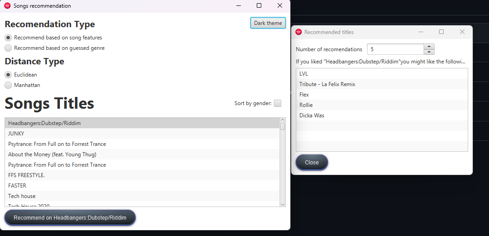
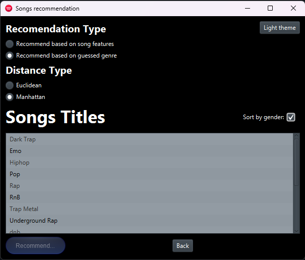
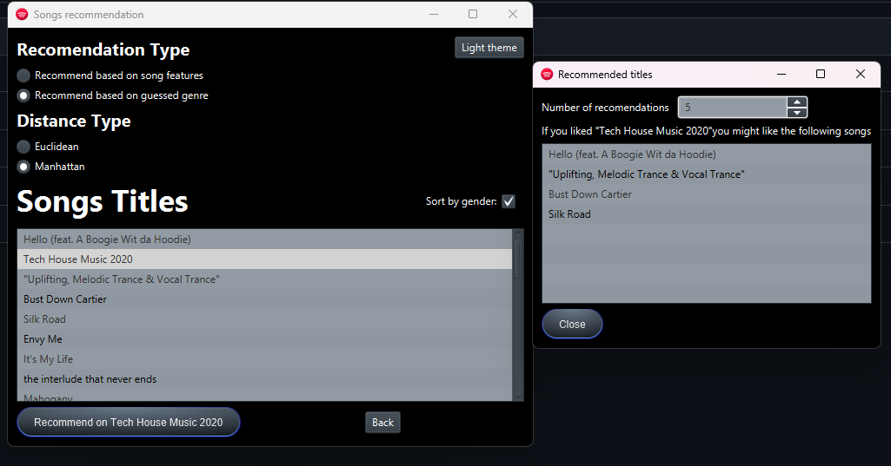

# SongsRecommender
  

## Descripción

**SongsRecommender** es una aplicación desarrollada en Java que permite a los usuarios obtener recomendaciones de canciones basadas en el estilo de una canción o género elegido.
Utiliza algoritmos de recomendación basados en aproximaciones matemáticas, como la distancia Manhattan y Euclidiana, para proporcionar sugerencias personalizadas. Este proyecto fue desarrollado en pareja durante un curso universitario.

## Características

- **Recomendación de Canciones**: Ofrece una lista de canciones similares al estilo de la canción o género seleccionado.
- **Algoritmos de Recomendación**: Utiliza distancias matemáticas para calcular la similitud entre canciones.
- **Interfaz Gráfica de Usuario**: La aplicación cuenta con una interfaz gráfica intuitiva y atractiva, desarrollada utilizando JavaFX, que proporciona una experiencia de usuario moderna y fácil de usar.

## Tecnologías Utilizadas

- **Lenguaje de Programación**: Java
- **Algoritmos Matemáticos**: Distancia Manhattan, Distancia Euclidiana
- **Interfaz Gráfica**: JavaFX
- **Gestión de Proyectos**: Maven
- **Entorno de Desarrollo**: IntelliJ IDEA

## Interfaz Gráfica

- **Recomendación de 5 canciones parecidas a la canción "Headbangers"**:
  

---

- **Agrupación de las canciones por géneros**:
  

---

- **Recomendación de 5 canciones parecidas al género de la canción "Tech House..."**:
  

